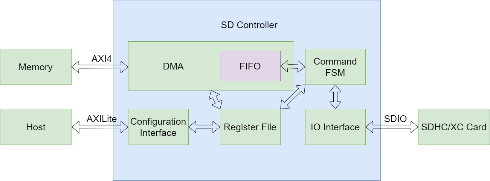
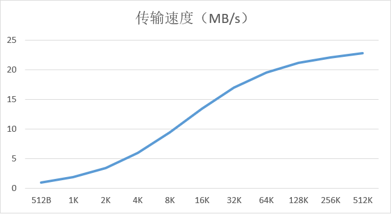

# AXI SDCard High Speed Controller

基于AXI接口的高速SD卡控制器

## 参考资料

该项目中的`sdcmd_ctrl.sv`与`sd_reader.sv`文件中的代码部分参考了`https://github.com/WangXuan95/FPGA-SDcard-Reader`项目，
同时也参考了`SD Specifications Part 1 Physical Layer Speicifcation Version 3.00 April 16, 2009`手册。

## 功能特性

该SD卡控制器拥有如下特性：

1. 运行在50MHz SDIO 4-wire 高速模式下
2. 工作在SD卡多块传输模型
3. 传输速率最高可达23MB/s
4. AXI4接口的主动DMA（支持256突发）
5. AXILite配置接口
6. 一次传输最大支持4GiB的数据
7. 起始扇区最大可为0xFFFFFFFF，即可以访问SD卡前1TiB整个范围的任意数据
8. 仅支持数据只读

## 设计架构



## 文件结构

代码位于rtl目录下，各个文件的用途如下所示：

|文件名|描述|
|---|---|
|sdcmd_ctrl.sv|SDIO PHY层，实现了基本的SDIO时序|
|sd_reader.sv|SDIO MAC层，实现了SD卡的基础命令集和扇区读取控制|
|sd_controller_regfile.sv|控制器的AXILite寄存器配置接口实现及配置寄存器实现|
|sd_controller_ping_pong_buffer.sv|Ping/Pong Buffer|
|sd_controller_axi_writer.sv|支持只写256突发的AXI4 DMA|
|sd_controller.sv|SD卡控制器顶层|
|sd_controller_wrapper.v|SD卡控制器的Verilog包装层|

## 实现原理

该控制器启动时首先输出400KHz时钟，在完成SD卡基础配置流程后输出25MHz时钟，在切换到高速模式后输出50MHz时钟。

为了实现如此高速的传输，该控制器的实现使用了一些Xilinx FPGA原语及约束，其中原语部分在Verilog包装层中实现，原理图如下：


其中：
* BUFG用于将SD Reader输出的时钟变换到FPGA专用时钟网络中以便改善各个FF的Timing
* ODDR用于将时钟与命令对齐输出，其中最上面的ODDR用于输出时钟，并且由于将D1接为0，D2接为1，ODDR将会输出一个与原时钟相位差180度的时钟，由于SDCMDOUT在SDCLK改变，在输出时钟反相后，SDCMD相对于输出时钟的Setup/Hold Timing都可以得到很大的改善，以便为信号在PCB上的走线提供足够的裕量。
* 将SDCMDOE打两拍是为了和输出的SDCMDOUT信号对齐，保证三态门在正确的时机切换。
* SDCMDIN先在IOB的FF上打一拍（此时信号属于sdclk_bufg时钟域），这同样保证信号经过PCB走线之后仍然拥有足够的Timing裕量。接下来将IOB FF输出的信号在LUT FF上再打一拍，此时采用的时钟是aclk，也就是控制器时钟（本例为100MHz），实现跨时钟域。这里之所以采用这种方式跨时钟域，是因为sdclk_bufg本身就是aclk的生成时钟，因此综合器STA可以正确计算Setup/Hold Time，使得一般情况下跨时钟域的亚稳态问题不会在这种情况下出现。
* SDDAT也是类似的情形，先在IOB FF上通过sdclk_bufg打一拍，然后用aclk打一拍，送入SDIO Reader。

## 硬件部署

顶层模块为sd_controller_wrapper，其中各端口描述如下：

|端口名|方向|描述|
|---|---|---|
|aclk|I|控制器时钟（也是AXI4和AXILite时钟），必须为100MHz|
|aresetn|I|控制器复位信号（也是AXI4和AXILite总线复位信号），低有效|
|axilite_*|I/O|AXILite Slave配置接口信号（配置空间大小4KB，地址数据宽度均为32bit）|
|axi_*|I/O|AXI4 Master DMA Write-Only接口信号（地址数据宽度均为32bit）|
|sdclk|O|SD卡时钟线|
|sdcmd|I/O|SD卡命令线|
|sddat|I|SD卡数据线|
|card_type|O|SD卡类型信号|
|card_stat|O|SD卡控制器状态机当前状态|
|interrupt|O|中断信号，高有效|
|test_*|O|仅供测试使用|

为了让综合器正确计算跨时钟域的STA，需要加入如下生成时钟约束（控制器时钟100MHz，SDIO时钟最大50MHz，按照2分频设置）：
```
create_generated_clock -name sdclk -source [get_pins top_design_i/clk_wiz_main/clk_out3] -divide_by 2 [get_pins top_design_i/sd_controller_wrapper_0/inst/sd_controller_inst/sd_reader_inst/sdcmd_ctrl_inst/sdclk_reg/Q]
```

其中注意将`top_design_i/clk_wiz_main/clk_out3`改为正确的控制器时钟。

目前已在`KC705`平台上测试通过，FPGA为`XC7K325T-2FFG900`，如需要使用其它的FPGA，注意替换`sd_controller_wrapper.v`中的原语。

## 软件部署

在src目录中附带了示例的软件驱动可供使用，该驱动提供了如下函数：

|函数|描述|
|---|---|
|sdcard_reset|复位SD卡控制器|
|wait_sdcard_ready|等待SD卡控制器就绪（有超时检测，超时会自动重发命令）|
|sdcard_read|读取SD卡数据，该函数会等待SD卡控制器就绪后再发起命令（有超时检测，超时会自动重发命令）|
|sdcard_is_busy|返回TRUE表示SD卡控制器繁忙|
|sdcard_get_progress|获取SD卡控制器进度|

其中，为了超时功能能够支持运行，需要用户填充`sdcard.c`中的`get_ms_time`函数，该函数的作用是范围以毫秒为单位的系统时间。

同时注意修改`sdc`变量中的地址，指向正确的SD卡控制器基地址。

## Register Map

|偏移|名称|属性|描述|
|---|---|---|---|
|0x00|CTRL|RW|控制寄存器|
|0x04|STAT|RO（INT位为RW）|状态寄存器|
|0x08|DSTADDR|RW|目标地址|
|0x0C|STARTSECTOR|RW|起始扇区|
|0x10|SECTORNUM|RW|扇区数（512字节为单位，必须为偶数）|
|0x14|PROGRESS|RO|当前进度（字节数）|
|0x18|RESET|RW|复位寄存器|

RW - 读写 RO - 只读

控制寄存器：

|位|名称|描述|
|---|---|---|
|31:2|保留|读恒为0|
|1|INT_EN|中断使能（1为使能，0为失能）|
|0|START|启动传输（该位写1启动，读恒为0）|

状态寄存器：

|位|名称|描述|
|---|---|---|
|31:9|保留|读恒为0|
|8:5|Card Stat|SD卡控制器状态机|
|4:3|Card Type|SD卡类型|
|2|INT|中断挂起（该位写1清除中断）|
|1|DMA Error|DMA写Memory发送错误|
|0|BUSY|正在传输中（为1表示正在传输中，为0表示空闲）|

Card Stat的取值及含义如下：

|取值|含义|
|---|---|
|0000|正在发送CMD0（GO_IDLE_STATE）命令，控制器保持空闲状态|
|0001|正在发送CMD8（SEND_IF_COND）命令并等待响应|
|0010|正在发送CMD55（APP_CMD）命令并等待响应|
|0011|正在发送ACMD41（SD_SEND_OP_COND）命令并等待响应|
|0100|正在发送CMD2（ALL_SEND_CID）命令并等待响应|
|0101|正在发送CMD3（SEND_RELATIVE_ADDR）命令并等待响应|
|0110|正在发送CMD7（SELECT_CARD）命令并等待响应|
|0111|正在发送CMD55（APP_CMD）命令并等待响应|
|1000|正在发送ACMD6（SET_BUS_WIDTH）命令并等待响应|
|1001|正在发送CMD6（SWITCH_FUNC）命令并等待响应|
|1010|正在发送CMD16（SET_BLOCKLEN）命令并等待响应|
|1011|准备发送CMD18（READ_MULTIPLE_BLOCK）命令|
|1100|正在等待CMD18（READ_MULTIPLE_BLOCK）命令响应|
|1101|正在从SD卡接收数据|
|1110|正在发送CMD12（STOP_TRANSMISSION）命令并等待响应|
|1111|等待数据接收状态机到达读取结束状态|

Card Type的取值及含义如下：

|取值|含义|
|---|---|
|0000|未知类型|
|0001|SD 1.0卡|
|0010|SD 2.0卡|
|0011|SDHC/XC 2.0卡|
|0100|或许是SD 1.0卡（只作为中间态，不作为最终态）|
|0101~1111|保留|

目的地址寄存器：

|位|名称|描述|
|---|---|---|
|31:0|DSTADDR|目标地址|

起始扇区寄存器：

|位|名称|描述|
|---|---|---|
|31:0|STARTSECTOR|起始扇区（一个扇区为512字节，不要超过SD卡容量范围）|

扇区数量寄存器：

|位|名称|描述|
|---|---|---|
|31:23|保留|读恒为0|
|22:1|SECTORNUM|扇区数（因为一次传输1KB数据，因此要求扇区数必须为偶数且不能为0，这也是AXI突发为256的原因，256 * 32bit = 1KiB）|
|0|保留|读恒为0|

当前进度寄存器：

|位|名称|描述|
|---|---|---|
|31:0|PROGRESS|当前DMA已传输完成数据量（字节数）|

复位寄存器：

|位|名称|描述|
|---|---|---|
|31:1|保留|读恒为0|
|0|RESET|写1复位SD卡控制器，读恒为0|

## 速率测试

该模块通过了FPGA下的大量数据传输实测，速率测试方法是使用两个寄存器（传输周期数寄存器及传输字节数寄存器）并通过ILA采样，根据时钟周期换算得到的，因此精度非常高。下图是实测的传输速率曲线（从SD卡传输到DDR3，SD卡为TECLAST UHS-1 64GB卡），其中横坐标为单次传输的块大小，纵坐标为传输速率：



可以看到传输速率在块大小为512KB时达到峰值约23MB/s，，再增加块大小传输速率基本没太大变化趋于饱和，此峰值数值已经接近硬件电源（3.3V）和时钟条件（50MHz SDIO 4-wire）下的理论上限25MB/s（50MHz * 4bit = 25MiB/Sec）。

具体数据表如下：

|数据大小（单位均为二进制Byte）|传输速度（MiB/Sec）|
|---|---|
|512B|0.95|
|1K|1.83|
|2K|3.39|
|4K|5.92|
|8K|9.42|
|16K|13.38|
|32K|16.94|
|64K|19.54|
|128K|21.16|
|256K|22.08|
|512K|22.81|